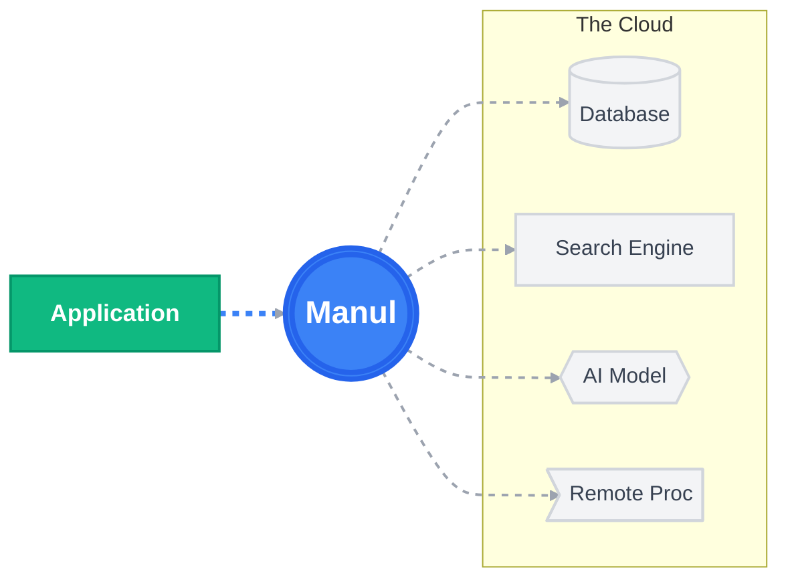
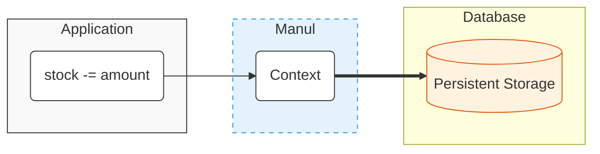
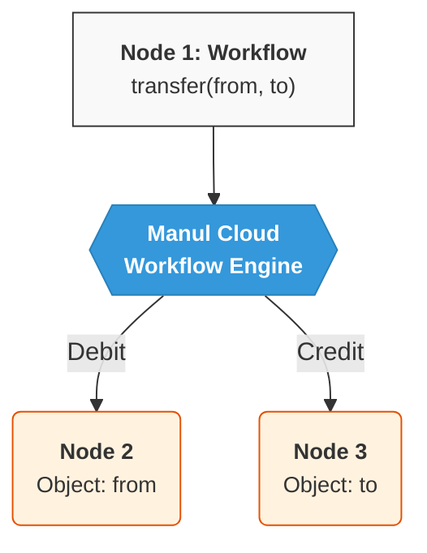
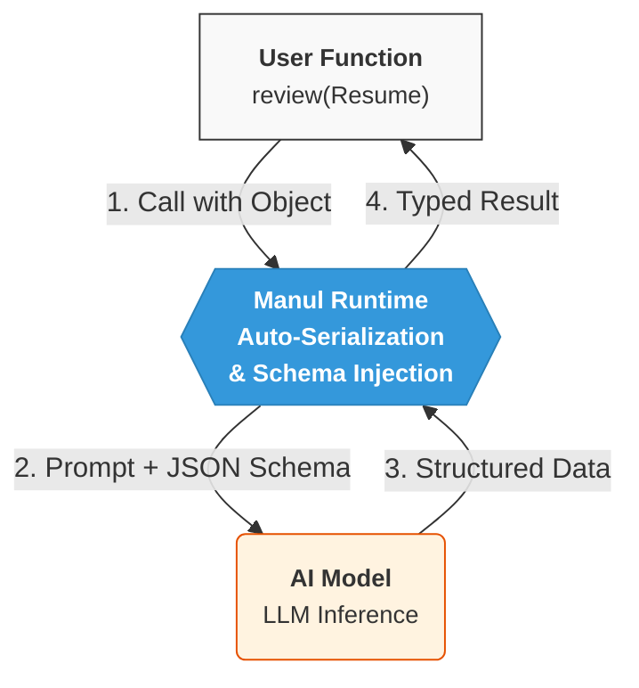

<!-- Background Blobs -->
<div class="absolute top-0 left-0 w-full h-full overflow-hidden -z-10 pointer-events-none">
  <div class="absolute top-[-10%] left-[-10%] w-96 h-96 bg-blue-50 dark:bg-blue-600/20 rounded-full blur-3xl opacity-60"></div>
  <div class="absolute bottom-[-10%] right-[-10%] w-[500px] h-[500px] bg-cyan-50 dark:bg-cyan-500/10 rounded-full blur-3xl opacity-60"></div>
</div>

<div class="flex flex-col items-center justify-center h-full">

  <!-- Icon/Logo -->
  <div class="mb-10 p-4 bg-white dark:bg-white/5 rounded-2xl shadow-sm border border-blue-100 dark:border-white/10 transform -rotate-3 transition-colors duration-300">
       
  </div>

  <!-- Main Title -->
  <h1 class="text-8xl font-black text-slate-900 dark:text-white mb-6 font-serif tracking-tight">
    Manul Cloud
  </h1>

  <!-- Subtitle with divider -->
  <div class="w-24 h-1 bg-gray-200 dark:bg-gray-700 rounded-full mb-8"></div>

  <p class="text-2xl text-slate-500 dark:text-slate-400 font-light">
    The cloud that looks like a 
    <span class="font-medium text-slate-800 dark:text-slate-100">giant computer</span>
  </p>

</div>

---


# The Problem

<div class="flex flex-col h-[85%] justify-between">

  <div class="text-xl opacity-80 mt-4">
    Application complexity skyrocketed with the advent of modern architecture.
  </div>

  <div grid="~ cols-3 gap-6" class="flex-grow mt-8">
      <!-- Card 1 -->
      <div class="bg-gray-50 dark:bg-white/5 rounded-xl p-6 border border-gray-200 dark:border-gray-700 flex flex-col gap-4">
          <div class="flex items-center gap-3">
             <div class="i-material-symbols-database text-4xl"/>
             <h4 class="text-xl font-bold m-0">Data/Code Gap</h4>
          </div>
          <p class="text-sm opacity-90 leading-relaxed">
              Bridging objects and database requires massive boilerplate.
              Managing schema changes is tedious, complex and risky.
          </p>
      </div>
      <!-- Card 2 -->
      <div class="bg-gray-50 dark:bg-white/5 rounded-xl p-6 border border-gray-200 dark:border-gray-700 flex flex-col gap-4">
          <div class="flex items-center gap-3">
             <div class="i-arcticons-meshenger text-4xl"/>
             <h4 class="text-xl font-bold m-0">Distributed Trap</h4>
          </div>
          <p class="text-sm opacity-90 leading-relaxed">
              Network calls are unreliable. Handling failures, retries, and distributed consistency turns simple logic into spaghetti code.
          </p>
      </div>
      <!-- Card 3 -->
      <div class="bg-gray-50 dark:bg-white/5 rounded-xl p-6 border border-gray-200 dark:border-gray-700 flex flex-col gap-4">
          <div class="flex items-center gap-3">
             <div class="i-streamline-artificial-intelligence-spark-solid text-4xl"/>
             <h4 class="text-xl font-bold m-0">AI Friction</h4>
          </div>
          <p class="text-sm opacity-90 leading-relaxed">
              AI is essential, yet integrating LLMs often means wrestling with unstructured text, prompts, and fragile parsers.
          </p>    
      </div>
  </div>

</div>

---

# The Solution

<div class="flex flex-col items-center justify-center h-[400px]">

<div class="text-xl text-opacity-80 mb-12">
  A programming language that turns the cloud into a giant computer.
</div>



</div>


---
level: 2
---

# Database as Memory

<div class="flex flex-row gap-8 mb-8">

<div>

Manul applications access data as if it resides in memory. 
- No data access boilerplate
- Strong local consistency
- Effortless schema evolution

</div>

<div class="flex items-center">

```manul
fn reduceStock(amount: int) {
    require(stock >= amount, "Insufficient stock")
    stock -= amount
}
```

</div>

<div>


</div>
</div>

<div>



</div>

---
level: 2
---

# Distributed By Design

<div grid="~ cols-2">

<div>

Manul makes developing distributed application easy.

- Remote objects look like local.
- Retry and idempotency are automatically handled by runtime.

<div class="mt-8">

```manul
fn transfer(from: Account, to: Account, amount: Money) {
    // Step 1: debit
    from.debit(amount) 

    // Step 2: The Runtime persists progress here.
    // If server crashes, Manul auto-resumes 
    // at Step 3 upon restart.

    // Step 3: credit
    to.credit(amount) 
}
```
</div>

</div>

<div class="flex justify-center">



</div>
</div>

---
level: 2
---

# AI as a Function

<div grid="~ cols-2 gap-16">
<div>

Defining an AI interaction is like writing a function with natural language as the code:

<div class="mt-8">

```manul
fn review(resume: Resume) -> ResumeReview {
    return llm(
        """
        Review the following resume:

        ${resume}
        """
    )
}
```

</div>

</div>
<div>



</div>
</div>

---

# The Adoption

<div class="opacity-80 mb-4">
  Marketing a new programming language is hard. <br/>
  <b>Manul</b> simplifies the task by integrating deeply into the Node ecosystem.
</div>

<div grid="~ cols-3 gap-6">

  <!-- Column 1: NPM -->
  <div class="bg-gray-100 dark:bg-white/10 p-4 rounded-lg flex flex-col gap-2">
    <div class="flex items-center gap-2 text-xl font-bold">
      <div class="i-logos-npm-icon text-2xl" />
      <span>NPM Support</span>
    </div>
    <div class="text-sm opacity-80">SDK downloadable via npm</div>
    
```shell
npm install -g manul
```
  </div>

  <!-- Column 2: Interop -->
  <div class="bg-gray-100 dark:bg-white/10 p-4 rounded-lg flex flex-col gap-2">
    <div class="flex items-center gap-2 text-xl font-bold">
      <div class="i-logos-typescript-icon text-2xl" />
      <span>JS/TS Interop</span>
    </div>
    <div class="text-sm opacity-80">Directly importable objects</div>

```manul
class Product(
    var name: string,
    var price: double
)
```
    <div class="i-carbon-arrow-down self-center opacity-50 size-3"/>
```ts
import { productApi } 
  from '@manul/api/product'

productApi.save({
    name: 'Hat',
    price: 100
})
```
  </div>

  <!-- Column 3: VS Code -->
  <div class="bg-gray-100 dark:bg-white/10 p-4 rounded-lg flex flex-col gap-2">
    <div class="flex items-center gap-2 text-xl font-bold">
      <div class="i-logos-visual-studio-code text-2xl" />
      <span>IDE Ready</span>
    </div>
    <div class="text-sm opacity-80">VS Code as the primary IDE</div>
    <div class="flex-1 flex items-center justify-center bg-black/5 dark:bg-black/40 rounded mt-2">
      <!-- Added styling to image to make it fit nicely -->
      
    </div>
  </div>

</div>

---

# The Competition

<div class="flex flex-col gap-6 mt-4">
    <!-- Intro Text -->
    <div class="text-center opacity-80 text-lg">
        Manul creates a new category of <b>Cloud-Native Language</b>.<br>
        The closest existing alternatives are Backend-as-a-Service platforms.
    </div>
    <!-- Main Comparison Grid -->
    <div grid="~ cols-2 gap-8" class="items-start">
        <!-- Left Column: The Competitors (BaaS) -->
        <div class="flex flex-col gap-4">
            <!-- Logos Header: Grouping Firebase & Supabase -->
            <div class="flex justify-center items-center gap-8 h-12 border-b border-gray-200 dark:border-gray-700 pb-2 mx-8">
                <div class="flex gap-2 items-center opacity-80">
                    <div class="i-logos-firebase-icon text-2xl"/>
                    <span>Firebase</span>
                </div>
                <div class="flex gap-2 items-center opacity-80">
                    <div class="i-logos-supabase-icon text-2xl"/>
                    <span>Supabase</span>
                </div>
            </div>
            <!-- Friction Box -->
            <div class="bg-yellow-50 dark:bg-yellow-500/10 p-6 rounded-xl border-l-4 border-yellow-500 h-full">
                <div class="text-yellow-700 dark:text-yellow-400 font-bold text-lg mb-4 flex items-center gap-2">
                    <div class="i-carbon-warning-filled text-xl" />
                    The BaaS Friction
                </div>
                <p class="text-base leading-relaxed opacity-90 mb-4">
                    They solve the <b>storage</b> problem, but not the <b>application</b> problem. 
                </p>
                <div class="text-sm opacity-80 leading-relaxed pl-2 border-l-2 border-yellow-500/30">
                Treating a database as a complete backend is a shortcut that fails the moment your application faces real-world complexity.
                </div>
            </div>
        </div>
        <!-- Right Column: Manul -->
        <div class="flex flex-col gap-4">
            <!-- Logo Header: Manul -->
            <div class="flex justify-center items-center gap-3 h-12 border-b border-gray-200 dark:border-gray-700 pb-2 mx-8">
                 
                 <span>Manul Cloud</span>
            </div>
            <!-- Advantage Box -->
            <div class="bg-blue-50 dark:bg-blue-500/10 p-6 rounded-xl border-l-4 border-blue-500 h-full">
                <div class="text-blue-700 dark:text-blue-400 font-bold text-lg mb-4 flex items-center gap-2">
                    <div class="i-ph-check-circle-fill text-xl" />
                    The Manul Advantage
                </div>
                <ul class="text-base leading-relaxed opacity-90 space-y-4">
                    <li>
                        <div class="font-bold text-blue-600 dark:text-blue-300 text-sm">Unified Runtime</div>
                        <div class="text-sm opacity-80 mt-1">No distinction between Database and Runtime.</div>
                    </li>
                    <li>
                         <div class="font-bold text-blue-600 dark:text-blue-300 text-sm">Zero-Glue Code</div>
                         <div class="text-sm opacity-80 mt-1">Remote data access looks exactly like local variables.</div>
                    </li>
                </ul>
            </div>
        </div>
    </div>

</div>


---
layout: center
class: text-center
---

# Manul Cloud

<div class="text-2xl op-60 mt-4">
The Future is Logic, Not Logistics.
</div>

<!-- <div class="mt-12">
<span class="px-6 py-3 border rounded border-current op-50 font-mono">npm install -g manul</span>
</div> -->

<div class="mt-12 flex justify-center gap-4 items-center">
    <div>
        <a href="https://www.github.com/wizardleeen/manul">
            <div class="flex items-center gap-2">
                <div class="i-logos-github-icon dark:invert dark:brightness-200 size-6"/>
                Github
            </div>
        </a>
    </div>
    <div>
        <a href="https://www.manul-lang.org">
            <div class="flex items-center gap-2">
                 
                Manul
            </div>
        </a>
    </div>
</div>